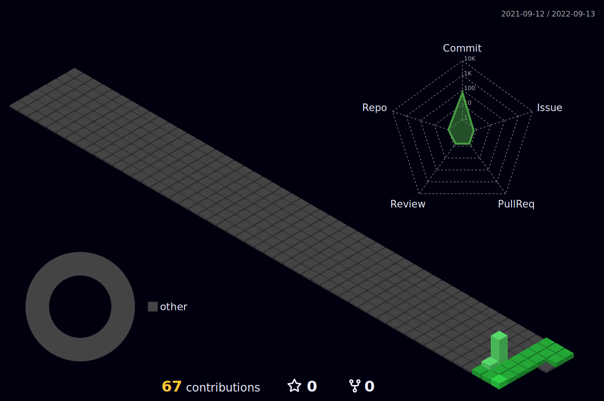

<body>
  

    <h1> Hi there, I'm Abdul Moiz👋<a href="#"></h1>
  

### I'm a C++, Python Developer, Researcher!
- 🌱 I’m currently improving my Computer Vision & Machine Learning skills.
- 👯 I’m looking to collaborate with other content creators and developers.
- 🥅 2022-23 Goals: Contribute more to Open Source projects and Execute my Innovative ideas.
- 💎 If you are a Tech geek, let's get connected :)  
 
<h2>Tech Stack</h2>

<table width="100">
<tr>
    
  <td align='center' width="200">
        
    </td>
 <td align='center' width="200">
        
    </td>
 <td align='center' width="200">
        
    </td>
	
 </td>
 <td align='center'>
        
    </td>

 <td align='center'>
        
    </td>
										    

 
</tr>

 
<tr>
    
 <td align='center'>
        
    </td>

</tr>
    
</table>

 
 

## Personal Projects

|      Project :octocat:   |     Issues :bug:   | Open PRs :bell:  | Closed PRs :fire:  | Last Commit 🚩
|-------------|-------------------|---|---| ----|
| [**Github Profile**](https://github.com/weirdrebel/weirdrebel) |  |   |    | |

	
 
 <h2>GitHub Analytics
 </h2>

  

 
	
## ⚡️Github Contributions
	
<h4 align="center">Isometric view of contributions in the last year</h4>

	

## 🚀Github Metrics

	

 

## 🐛Github Magic Game

  

 

<h2 >🏆 GitHub Profile Trophy</h2>

 

<h2 >🛡 Holopin Badge Board</h2>
 

 

<h3 align="center">Views</h3>

 
  

